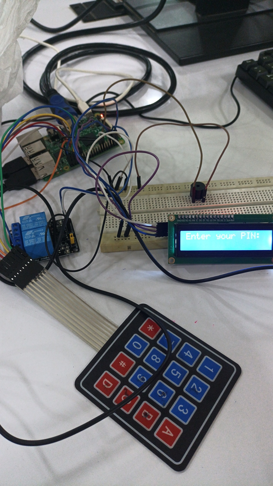

# Smart-door-lock-security-system
The Smart Door Lock Security System is a microcontroller-based project designed to enhance home security.The core idea is to use a keypad or RFID module connected to a microcontroller (such as Arduino, NodeMCU, or Raspberry Pi). When a person enters a predefined password the system verifies the input.

---

### 📽️ Demo Video  
[▶️ Click here to watch the demo video](videodemo.mp4)

---

## Table of Contents

- [Overview](docs/00_overview.md)
- [Components Required](docs/01_components.md)
- [Code Upload](docs/02_codeupload.md)
- [Working Mechanism](docs/03_workingmechanism.md)
- [Code](code.md)
- [Result](images/result.png)
- [Sample Image](images/image.png)
- [video result](videodemo.mp4)

---

### ✅ Final Output

### 🖼️ Sample Image

---
